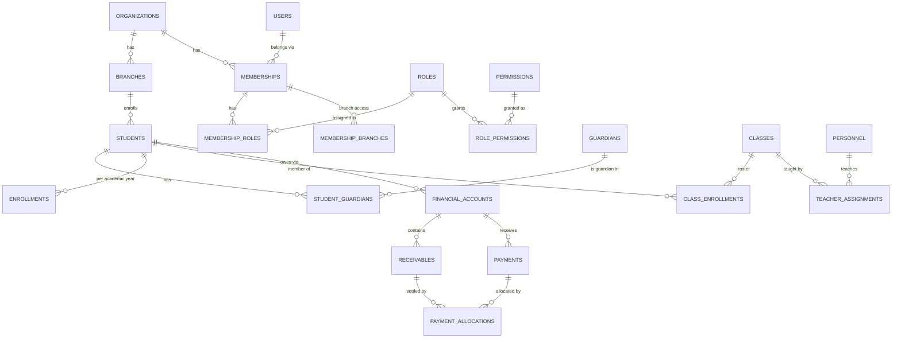

# Data model

> Designed before the first migration. Implemented in `apps/api/src/platform/database/schema`
> (Drizzle) and `apps/api/drizzle/*.sql` (migrations). Tenancy rules: [MULTITENANCY](MULTITENANCY.md);
> finance semantics: [FINANCE_MODEL](FINANCE_MODEL.md).

## 1. Conventions

| Topic | Convention |
| ----- | ---------- |
| Primary keys | `id uuid`, UUIDv7 generated by the application (time-ordered → index locality); DB default `gen_random_uuid()` for manual SQL |
| Tenant key | `organization_id uuid NOT NULL` on tenant-owned tables, `UNIQUE (organization_id, id)` |
| Branch key | `branch_id uuid NOT NULL` on branch-owned tables; finance tables also declare `UNIQUE (organization_id, branch_id, id)` so children can prove they live in the same branch |
| References | Composite FKs `(organization_id, x_id)` (or `(organization_id, branch_id, x_id)` in finance); `ON DELETE RESTRICT` unless the child is pure metadata |
| Enumerations | `text` + `CHECK` constraints (easy to evolve, readable in SQL) |
| Timestamps | `timestamptz`, `created_at`/`updated_at` (trigger-maintained) |
| Calendar dates | `date` in the organization's time zone |
| Money | `bigint` minor units + `currency char(3)` |
| Deletion | Business records are archived (`archived_at`); financial records are never deleted |
| Case-insensitive text | `citext` for e-mails and slugs |
| Search | `search_text` generated column = `app.search_normalize(...)` (unaccent + lower, Turkish-safe) with a trigram GIN index |
| Sensitive identifiers | `*_ciphertext` (AES-256-GCM, key from env) + `*_hash` (HMAC-SHA-256 blind index for exact match) + `*_last4` for masked display |

## 2. TenantCore

| Table | Scope | Key columns | Notes |
| ----- | ----- | ----------- | ----- |
| `organizations` | tenant root | `slug` (citext, unique), `name`, `status`, `plan_key`, `locale`, `timezone`, `default_currency`, `settings jsonb` | Future: `group_id` for chains |
| `branches` | branch | `code` (unique per org), `name`, `status`, `city`, `district`, `address`, `phone`, `email`, `is_headquarters` | RLS branch boundary applies to `id` |
| `users` | global | `email` (citext, unique), `full_name`, `password_hash` (nullable), `status`, `platform_role`, `last_login_at`, `password_changed_at`, `failed_login_attempts`, `locked_until` | `password_hash` unreadable by `app_runtime` (column privileges) |
| `sessions` | global | `token_hash`, `csrf_token_hash`, `user_id`, `active_organization_id`, `active_membership_id`, `ip`, `user_agent`, `idle_expires_at`, `absolute_expires_at`, `revoked_at`, `revoked_reason` | `app_system` only |
| `password_reset_tokens` | global | `token_hash`, `user_id`, `expires_at`, `used_at` | `app_system` only |
| `memberships` | org | `user_id`, `status` (invited/active/suspended), `all_branches`, `title`, `authz_version`, `invited_at`, `joined_at`, `suspended_at` | `UNIQUE (organization_id, user_id)` |
| `membership_branches` | org | `membership_id`, `branch_id` | Branch access when `all_branches = false` |
| `invitations` | org | `membership_id`, `email`, `token_hash`, `status`, `expires_at`, `send_count`, `last_sent_at` | Token lookups run as `app_system` |
| `permissions` | global | `key` (pk), `module`, `allowed_scopes text[]`, `sensitivity`, `description`, `deprecated_at` | Synced from `@repo/authorization` |
| `roles` | org | `key` (unique per org), `name`, `description`, `is_system`, `template_key`, `archived_at` | System roles are read-only copies of templates |
| `role_permissions` | org | `role_id`, `permission_key` → `permissions.key`, `scope` | PK `(role_id, permission_key)` |
| `membership_roles` | org | `membership_id`, `role_id`, `assigned_by_membership_id` | PK `(membership_id, role_id)` |
| `organization_modules` | org | `module_key`, `enabled` | Module switches (plan-driven defaults) |
| `audit_logs` | org (nullable for platform events) | `actor_type`, `actor_user_id`, `actor_membership_id`, `support_session_id`, `action`, `resource_type`, `resource_id`, `branch_id`, `changes jsonb`, `metadata jsonb`, `ip`, `user_agent`, `request_id`, `occurred_at` | Append-only (grants + trigger) |
| `outbox_events` | org (nullable) | `aggregate_type`, `aggregate_id`, `event_type`, `event_version`, `payload`, `metadata`, `occurred_at`, `available_at`, `published_at`, `attempts`, `last_error`, `status` | `app_runtime` may only `INSERT` |
| `document_sequences` | org | PK `(organization_id, sequence_key, period)`, `next_value` | Gap-tolerant numbering via `INSERT … ON CONFLICT DO UPDATE … RETURNING` |

Planned TenantCore tables (added with their features): `support_access_sessions`, `notifications`,
`notification_templates`, `tasks`, `files`, `notes`, `custom_field_definitions`,
`feature_flag_overrides`, `integration_connections`, `webhook_endpoints`, `webhook_deliveries`,
`api_keys`, `user_identities` (SSO).

## 3. Education

| Table | Scope | Key columns | Notes |
| ----- | ----- | ----------- | ----- |
| `academic_years` | org | `name`, `starts_on`, `ends_on`, `status`, `is_current` | One current year per org (partial unique) |
| `grade_levels` | org | `code`, `name`, `stage`, `sort_order` | e.g. `9` / "9. Sınıf" |
| `personnel` | branch | `membership_id` (nullable), `first_name`, `last_name`, `position`, `department`, `employment_type`, `email`, `phone`, `hire_date`, `status`, `search_text` | A teacher with system access links to a membership |
| `students` | branch | `student_number` (unique per org), `first_name`, `last_name`, `gender`, `birth_date`, `national_id_ciphertext/hash/last4`, `status`, `enrolled_on`, `email`, `phone`, `address`, `custom_fields jsonb`, `search_text`, `archived_at` | Never hard-deleted |
| `guardians` | org | `first_name`, `last_name`, `phone`, `email`, `occupation`, `address`, `national_id_*`, `custom_fields`, `search_text`, `archived_at` | Org-level: one guardian can have children in several branches |
| `student_guardians` | org | `student_id`, `guardian_id`, `relationship`, `is_primary_contact`, `is_financially_responsible` | PK `(student_id, guardian_id)` |
| `enrollments` | branch | `student_id`, `academic_year_id`, `grade_level_id`, `status`, `enrolled_on`, `ended_on`, `end_reason` | One active enrollment per student and year |
| `classes` | branch | `academic_year_id`, `grade_level_id`, `name`, `capacity`, `status` | e.g. "9-A" |
| `class_enrollments` | branch | `class_id`, `student_id`, `status`, `starts_on`, `ends_on` | Class roster; drives teacher `assigned` scope |
| `teacher_assignments` | branch | `class_id`, `personnel_id`, `role` (homeroom/subject), `subject`, `starts_on`, `ends_on` | |

Planned: `prospects`, `prospect_activities` (admissions CRM, phase 2); `attendance_sessions`,
`attendance_records` (phase 4); exams, homework, guidance, transport… (future modules).

**Deviation:** the initial list had `class_memberships`; it is named `class_enrollments` to match
the domain language ("sınıf listesi"), and `grades` is `grade_levels` to avoid confusion with exam
grades.

## 4. Finance

| Table | Scope | Key columns | Notes |
| ----- | ----- | ----------- | ----- |
| `financial_accounts` | branch | `student_id`, `currency`, `status` | `UNIQUE (organization_id, student_id, branch_id, currency)` |
| `tuition_agreements` | branch | `account_id`, `student_id`, `academic_year_id`, `enrollment_id`, `responsible_guardian_id`, `title`, `currency`, `gross_amount_minor`, `discount_total_minor`, `net_amount_minor`, `status`, `signed_on`, `notes` | `CHECK (net = gross − discount_total)` |
| `agreement_discounts` | branch | `agreement_id`, `sort_order`, `category`, `label`, `kind`, `percentage_bps`, `fixed_amount_minor`, `amount_minor` | Scholarships are a discount category |
| `payment_plans` | branch | `agreement_id`, `account_id`, `status`, `installment_count`, `first_due_date`, `frequency`, `down_payment_minor`, `total_minor`, `rounding_unit_minor` | One active plan per agreement |
| `receivables` | branch | `account_id`, `student_id`, `agreement_id`, `payment_plan_id`, `kind` (installment/charge), `sequence_no`, `category`, `description`, `currency`, `amount_minor`, `allocated_minor`, `due_date`, `status`, `overdue_marked_at`, `cancelled_at`, `cancel_reason` | Replaces separate `installments`/`charges` ([ADR-0009](../decisions/0009-unified-receivables.md)) |
| `payments` | branch | `account_id`, `student_id`, `payer_guardian_id`, `payer_name`, `currency`, `amount_minor`, `allocated_minor`, `refunded_minor`, `method`, `status`, `received_at`, `receipt_number`, `reference`, `idempotency_key`, `request_hash`, `provider`, `provider_reference`, `payment_intent_id`, `reversed_at`, `reversal_reason` | Immutable except the reversal transition |
| `payment_allocations` | branch | `payment_id`, `receivable_id`, `account_id`, `amount_minor`, `reversed_at`, `reversal_reason` | Insert-only; triggers maintain cached sums |
| `payment_intents` | branch | `account_id`, `provider`, `provider_reference`, `amount_minor`, `currency`, `status`, `checkout_url`, `expires_at`, `payment_id` | Online payment links |
| `payment_provider_events` | platform inbox | `provider`, `provider_event_id` (unique together), `event_type`, `organization_id`, `payload`, `status`, `error` | `app_system` only |

Planned: `refunds` (with the refund UI), `reconciliation_records` (bank statement import),
`reminder_rules`, `late_fee_policies`.

## 5. Relationship overview

## 6. Index strategy

- Every tenant query filters by `organization_id`, so composite indexes start with it.
- Lists: `students (organization_id, branch_id, status)`, `students (organization_id, last_name, first_name)`.
- Search: trigram GIN on `search_text` (students, guardians, personnel).
- Collections: `receivables (organization_id, account_id, due_date)`,
  `receivables (organization_id, due_date) WHERE status = 'open'`,
  `payments (organization_id, received_at DESC)`.
- Audit: `audit_logs (organization_id, occurred_at DESC)` and
  `(organization_id, resource_type, resource_id, occurred_at DESC)`.
- Outbox relay: `outbox_events (available_at) WHERE status = 'pending'`.
- Partial unique indexes for idempotency keys, provider references, current academic year, active
  plan per agreement, active enrollment per student/year.

## 7. Retention (to be confirmed with legal review)

| Data | Default retention | Mechanism |
| ---- | ----------------- | --------- |
| Financial records | ≥ 10 years (Turkish commercial/tax record-keeping) | Never deleted by the application |
| Audit logs | 10 years for finance actions, 2 years for others | Partition by month later; export to cold storage |
| Sessions, reset tokens | 30 days after expiry | Scheduled cleanup |
| Published outbox events | 30 days | Scheduled cleanup (`app_system`) |
| Archived students/guardians | Configurable per organization | Anonymization job (planned) |
