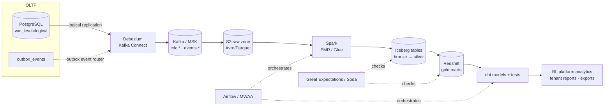

# Data platform (future)

> Status: **design only.** Nothing in this document runs today. The MVP answers operational
> questions directly from PostgreSQL (FINANCE_MODEL §9). This design explains how analytics and
> machine learning will be added without changing the transactional system, and which decisions
> made now keep that path open.

## 1. Why a separate platform, and when

Operational screens (collections dashboard, aging, overdue lists) stay on PostgreSQL: they need
fresh data, tenant scoping and RLS, and the volumes are modest. A data platform becomes worthwhile
for workloads the transactional database should not carry:

- Cross-tenant product analytics for the platform team (adoption, feature usage, cohort retention).
- Historical and trend reporting for education groups across many years and branches.
- Finance analytics: cash-flow forecasting, collection-rate benchmarks, late-payment risk.
- Machine-learning features (e.g. likelihood of late payment) and exports to BI tools.

**Triggers to start** (any of): reports that need more than a year of history across tenants,
analytical queries measurably affecting OLTP latency, or a contract requiring BI/data exports.

## 2. Decisions already made in the core that enable this

| Decision                                              | Benefit for the data platform                                    |
| ----------------------------------------------------- | ---------------------------------------------------------------- |
| Transactional outbox with versioned events (ADR-0010) | Stable business-event contracts, decoupled from table layouts    |
| `organization_id` (+ `branch_id`) on every tenant row | Tenant partitioning and row-level filtering downstream           |
| UUIDv7 keys                                           | Globally unique, time-ordered keys; no collisions across sources |
| Money as integer minor units + currency               | Exact sums in every engine; no float drift                       |
| Immutable payments, reversals instead of edits        | Append-only facts, simple incremental loads                      |
| Encrypted national IDs + blind index                  | Sensitive values never leave the OLTP system in clear text       |
| Event payloads without names/contact details          | Events can flow to analytics without personal data by default    |

## 3. Target architecture

| Layer           | Technology (AWS reference)                    | Responsibility                                          |
| --------------- | --------------------------------------------- | ------------------------------------------------------- |
| Capture         | Debezium on Kafka Connect                     | Change data capture from the WAL; outbox event routing  |
| Transport       | Kafka (Amazon MSK) + schema registry          | Durable, replayable streams; schema evolution checks    |
| Raw storage     | S3 (Avro/Parquet), date-partitioned           | Immutable landing zone for replay and audits            |
| Processing      | Spark (EMR Serverless or Glue)                | Deduplication, pseudonymization, conformance            |
| Table format    | Apache Iceberg                                | ACID tables, time travel, row-level deletes for erasure |
| Warehouse       | Amazon Redshift (or Athena for small volumes) | Gold marts for BI and tenant-facing reports             |
| Transformation  | dbt                                           | Versioned SQL models, documentation, tests              |
| Orchestration   | Apache Airflow (MWAA)                         | Schedules, backfills, dependencies, SLAs                |
| Data quality    | Great Expectations or Soda                    | Contracts between layers; freshness and volume checks   |
| Catalog/lineage | Glue Data Catalog + OpenLineage               | Discovery, ownership, lineage, PII tags                 |

## 4. Two kinds of data: events and state

1. **Business events** from `outbox_events` (e.g. `payment.received`, `agreement.created`). They
   express intent and are the preferred source for facts. Today the worker relays them to a log or
   a BullMQ queue; in this architecture Debezium's outbox event router publishes them to
   `events.<event_type>` topics, keyed by aggregate id for ordering per aggregate.
2. **State** via CDC of selected tables (students, receivables, payments, memberships…) into
   `cdc.<table>` topics, for slowly changing dimensions and reconciliation.

Event contract rules (already enforced in code review):

- An event has `id`, `organizationId`, `aggregateType`, `aggregateId`, `eventType`,
  `eventVersion`, `payload`, `metadata` (request id, actor) and `occurredAt`.
- Event names are never renamed; incompatible changes create a new `eventVersion`.
- Payloads carry identifiers, amounts in minor units with currency, and dates — no names, phone
  numbers, e-mail addresses or national IDs.
- Delivery is at-least-once; consumers deduplicate on the event `id`.

## 5. Medallion layers

| Layer  | Content                                                                                                 | Personal data                          |
| ------ | ------------------------------------------------------------------------------------------------------- | -------------------------------------- |
| Raw    | Exactly what was captured (Avro/Parquet), short retention                                               | As captured; strict access, encrypted  |
| Bronze | Deduplicated, typed, schema-validated tables                                                            | Limited set; restricted access         |
| Silver | Conformed entities; **pseudonymized** (tenant-salted hashes for person ids; direct identifiers dropped) | None directly identifying              |
| Gold   | Marts: collections facts, enrollment snapshots, usage metrics                                           | None; aggregates and pseudonymous keys |

Example gold models: `fct_payments`, `fct_receivables_daily_snapshot`, `fct_collections_monthly`,
`dim_student_pseudo`, `dim_branch`, `dim_organization`, `fct_feature_usage`.

## 6. Tenant isolation downstream

- Every row keeps `organization_id`; gold tables are partitioned or clustered by it.
- Tenant-facing reports query through warehouse row-level security bound to the tenant (Redshift
  RLS policies or per-tenant views), mirroring the OLTP model; there is no shared login for tenants.
- Platform analytics use aggregated or pseudonymized data only; small groups are suppressed
  (minimum group size) to prevent re-identification.

## 7. Privacy, retention and erasure

- PII classification is derived from the permission catalog's `sensitivity` and column tags kept in
  the data catalog; Lake Formation (or equivalent) enforces column-level access.
- Encrypted columns stay encrypted; the platform never receives decryption keys.
- Erasure/anonymization requests produce tombstone events; Iceberg row-level deletes and
  compaction remove the data from bronze/silver; gold aggregates are rebuilt.
- Retention per zone (proposal): raw 30 days, bronze 13 months, silver/gold per the legal retention
  schedule (to be confirmed, see SECURITY §14).

## 8. Data quality

- Contracts at bronze→silver: schema, uniqueness of event ids, referential integrity within a
  tenant, non-negative amounts, currency codes.
- Reconciliation jobs: sum of payments per tenant and day equals the OLTP aggregate; allocation
  totals never exceed payment amounts (the same invariants the database enforces).
- Freshness and volume checks with alerting through Airflow SLAs.

## 9. Phased adoption

| Phase   | Scope                                                                                | Infrastructure                        |
| ------- | ------------------------------------------------------------------------------------ | ------------------------------------- |
| A (now) | Operational aggregates in PostgreSQL; outbox relayed by the worker                   | PostgreSQL, Redis                     |
| B       | Nightly extracts from a read replica to S3; dbt models on Athena/Redshift Serverless | Replica, S3, dbt, Airflow             |
| C       | Streaming CDC and outbox events through Debezium and Kafka; Iceberg lakehouse        | MSK, Kafka Connect, EMR/Glue, Iceberg |
| D       | Feature store and ML (late-payment risk, enrollment forecasting)                     | SageMaker or equivalent               |

Phase B is cheap and covers most reporting needs; Phase C is justified by latency requirements or
volume, not by fashion.

## 10. Operational concerns

- **Replication slots:** monitor slot lag; a stuck connector retains WAL and can fill the disk.
- **Schema evolution:** schema registry compatibility mode `BACKWARD`; migrations that rename or
  drop captured columns need a coordinated change.
- **Backfills:** replay from the raw zone or Kafka retention; snapshot new tables with Debezium
  incremental snapshots.
- **Cost:** start serverless (Redshift Serverless, EMR Serverless), revisit at steady volume.

## 11. Open decisions

- Cloud region and data residency for analytics data (Turkey vs. EU), aligned with the OLTP
  hosting decision.
- Redshift vs. Athena-only for Phase B; managed Kafka vs. a managed CDC service.
- Which tenant-facing reports move from in-app (PostgreSQL) to the warehouse, and their freshness
  guarantees.
