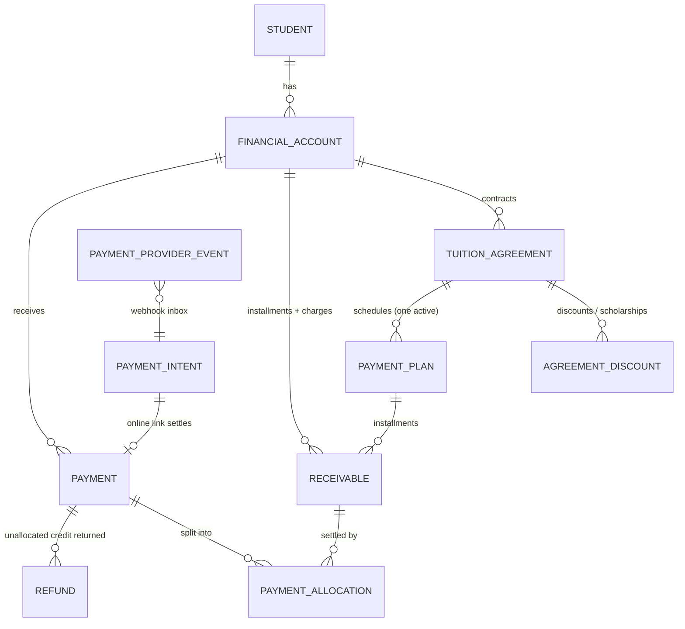

# Finance model — collections and receivables

> Decision records: [ADR-0008 money as integer minor units](../decisions/0008-money-integer-minor-units.md),
> [ADR-0009 unified receivables](../decisions/0009-unified-receivables.md),
> [ADR-0010 transactional outbox](../decisions/0010-transactional-outbox.md).

## 1. Scope

CampusOS finance is an **education-focused receivables and collections system**: it knows what each
student's family owes, when, what has been paid, what is overdue and what cash to expect. It is
**not** a general ledger. Accounting integration (exporting journal entries to the school's
accounting package, e-Arşiv/e-Fatura) is a planned integration, not part of this model.

Questions the model must answer quickly:

- Who owes us money today, and how much is overdue?
- How much cash should arrive this month?
- What is our collection rate?
- Which students pay late repeatedly? Which payment plans are becoming risky?

## 2. Money

- Amounts are **integers in minor units** (`bigint` in PostgreSQL, safe integers in TypeScript):
  `₺12.500,00` is stored as `1250000`. No floating point anywhere.
- Every monetary row stores an ISO-4217 `currency` (`char(3)`); the minor-unit exponent comes from
  the currency (TRY/USD/EUR: 2).
- The API exchanges `{ "amountMinor": 1250000, "currency": "TRY" }`; the UI formats with
  `Intl.NumberFormat('tr-TR', { style: 'currency' })`.
- Rounding: **half up** (away from zero for positive amounts) at the minor unit, only where a
  computation produces fractions (percentage discounts, installment splits).
- One **financial account per student and currency**. No FX conversion; KPIs are grouped by
  currency and dashboards show the organization's default currency first.

## 3. Entities



| Entity                    | Purpose                                                                                                                                                         |
| ------------------------- | --------------------------------------------------------------------------------------------------------------------------------------------------------------- |
| `financial_accounts`      | The student's receivable account ("cari hesap") in one currency. Anchor for balance, credit and statement.                                                      |
| `tuition_agreements`      | Contract for a service period (e.g. "2026–2027 eğitim ücreti"): gross amount, discounts, net amount, responsible guardian.                                      |
| `agreement_discounts`     | Ordered discount lines: sibling, early payment, staff, corporate, **scholarship**; percentage (basis points) or fixed. Computed amount stored.                  |
| `payment_plans`           | Installment schedule of an agreement. Restructuring supersedes the active plan and creates a new one; history is kept.                                          |
| `receivables`             | Everything a family owes: `kind = installment` (from a plan) or `kind = charge` (books, uniform, trip, transport…). Due date, amount, allocated amount, status. |
| `payments`                | Money received: amount, method, received_at, payer, receipt number, provider reference, idempotency key. Immutable once completed.                              |
| `payment_allocations`     | How a payment settles receivables. Insert-only; reversal marks rows as reversed.                                                                                |
| `refunds`                 | Return of a payment's unallocated credit.                                                                                                                       |
| `payment_intents`         | Online payment links (provider checkout); settled through webhooks.                                                                                             |
| `payment_provider_events` | Webhook inbox: raw (sanitized) events, unique per provider event id.                                                                                            |
| `document_sequences`      | Per-organization numbering (receipt numbers, student numbers).                                                                                                  |

**Deviation from the initial entity list:** `installments` and `charges` are one table,
`receivables`, discriminated by `kind`. Allocation, overdue detection, aging, reminders and
statements all operate on "something owed with a due date", so one table removes polymorphic
foreign keys and duplicated logic. The UI still presents "Taksitler" and "Ek ücretler" separately
([ADR-0009](../decisions/0009-unified-receivables.md)). Reconciliation records are planned with the
bank-statement import feature (§13).

## 4. Agreement calculation

```
gross amount
  − discount 1 (applied to gross)
  − discount 2 (applied to the remainder after discount 1)
  − …
= net amount  (≥ 0)
```

- Discounts apply **in order**; a percentage discount applies to the amount remaining after the
  previous discounts. This keeps the total below 100 % and matches how stacked discounts
  (e.g. sibling + early payment) are usually explained to families. Each line stores its computed
  amount so the breakdown is reproducible.
- Percentages are stored in **basis points** (`1000` = 10 %) to stay in integer arithmetic.
- The preview endpoint (`POST /finance/agreements/preview`) returns the full breakdown and the
  installment schedule before anything is saved; the UI never re-implements the calculation.

## 5. Installment schedule

Inputs: net amount, optional down payment (+ its due date), installment count `n`, first due date,
monthly frequency, rounding unit.

1. `remaining = net − down payment`.
2. Each installment is `floor(remaining / n)` rounded **down to the rounding unit** (default: whole
   currency units, i.e. 100 minor units for TRY, so families see round amounts).
3. The rounding difference is added to the **last** installment (configurable: first).
4. Due dates: the same day-of-month as the first due date, clamped to the month's last day
   (Jan 31 → Feb 28/29 → Mar 31).
5. Down payment becomes installment `sequence_no = 0`.

Invariant (unit-tested with property-style cases): `sum(installments) + down payment = net`, every
installment `> 0`, due dates strictly increasing.

## 6. Payments and allocation

- **Recording** (`POST /finance/payments`) requires an `Idempotency-Key` header; the key is unique
  per organization. A retried request with the same key and body returns the original payment; the
  same key with a different body returns `409 IDEMPOTENCY_KEY_REUSED`.
- **Automatic allocation (default)**: oldest first — open receivables of the account ordered by
  `due_date`, then installments before charges, then `sequence_no`, then creation time.
- **Manual allocation**: the user picks receivables and amounts; each amount must be ≤ the
  receivable's outstanding amount and the total ≤ payment amount.
- Any unallocated remainder is **account credit** (`payments.amount − allocated − refunded`). It can
  be allocated later or refunded.
- Methods: `cash`, `bank_transfer`, `credit_card`, `pos`, `online`, `check`, `other`.
- Receipt numbers: `TAH-<year>-<000001>`, unique per organization, generated in the same
  transaction.

## 7. Corrections: reversal, refund

A completed payment is **never edited or deleted**.

- **Reversal** (`finance.payments.reverse`, reason required): the payment moves to `reversed`,
  every active allocation is marked reversed, receivables re-open, an audit record and a
  `payment.reversed` event are written. The original row keeps all its data plus
  `reversed_at`, `reversed_by`, `reversal_reason`. Reversal is refused while refunds exist.
- **Refund** (`finance.refunds.create`): returns unallocated credit; increments
  `payments.refunded_minor`.
- **Receivable corrections**: amount, currency and account are immutable. A wrong installment is
  cancelled (with reason) and replaced, or the plan is restructured. Due-date changes are allowed
  and audited.

## 8. Overdue and aging

- "Today" is the organization-local date (`organizations.timezone`, default `Europe/Istanbul`).
- A receivable is **overdue** when it is open, has an outstanding amount and `due_date < today`.
  Due today is _not_ overdue.
- Aging buckets by days overdue: **not due**, **1–30**, **31–60**, **61–90**, **90+**.
- A scheduled job marks newly overdue receivables (`overdue_marked_at`) and emits
  `installment.overdue` exactly once per receivable.

## 9. KPI definitions

| KPI                      | Definition                                                                                                          |
| ------------------------ | ------------------------------------------------------------------------------------------------------------------- |
| Due today                | Outstanding of open receivables with `due_date = today`                                                             |
| Overdue receivables      | Outstanding of open receivables with `due_date < today`                                                             |
| Payments today           | Sum of completed (non-reversed) payments with `received_at` on the local date                                       |
| Collected this month     | Completed payments received in the current local month                                                              |
| Expected this month      | Outstanding of open receivables due between today and month end                                                     |
| Collection rate (period) | `allocated to receivables due in period ÷ amount due in period` (cancelled excluded, reversed allocations excluded) |
| Aging                    | Outstanding per bucket (§8)                                                                                         |
| Recurring late payers    | Accounts with ≥ 2 receivables settled after their due date, or ≥ 2 currently overdue, in the last 6 months          |
| Risky plans              | Active plans with ≥ 2 overdue installments or overdue outstanding ≥ 25 % of plan total                              |

## 10. Invariants and where they are enforced

| Invariant                                                        | Enforcement                                                                                     |
| ---------------------------------------------------------------- | ----------------------------------------------------------------------------------------------- |
| Amounts are positive integers                                    | `CHECK (amount_minor > 0)`                                                                      |
| Allocation total ≤ payment amount                                | `CHECK (allocated_minor + refunded_minor <= amount_minor)` on `payments`, maintained by trigger |
| Receivable never over-allocated / negative balance               | `CHECK (allocated_minor BETWEEN 0 AND amount_minor)` on `receivables`, maintained by trigger    |
| Same account and currency for payment, allocation and receivable | Trigger on `payment_allocations`                                                                |
| Cross-tenant references impossible                               | Composite foreign keys `(organization_id, …)`                                                   |
| Completed payments immutable; only `completed → reversed`        | Trigger                                                                                         |
| Allocations insert-only; reversal is one-way                     | Trigger                                                                                         |
| No deletion of financial history                                 | No `DELETE` grant for runtime roles; `ON DELETE RESTRICT`; students are archived, never deleted |
| Manual payment idempotency                                       | Unique `(organization_id, idempotency_key)`                                                     |
| Webhook replay safety                                            | Unique `(provider, provider_event_id)` + unique provider reference per payment                  |
| Explicit currency                                                | `currency char(3) NOT NULL CHECK (currency ~ '^[A-Z]{3}$')`                                     |
| Timezone meaning                                                 | Instants are `timestamptz`; due dates are `date` in the organization's timezone                 |

Application code validates the same rules first to return friendly errors; the database is the
backstop.

## 11. Payment providers

```ts
interface PaymentProvider {
  readonly key: string; // 'mock', 'iyzico', 'paytr', 'stripe'
  createPaymentLink(
    input,
  ): Promise<{ providerReference: string; checkoutUrl: string; expiresAt: Date }>;
  parseWebhook(rawBody: Buffer, headers: Headers): Promise<ProviderWebhookEvent>; // verifies signature
}
```

- `MockPaymentProvider` signs webhooks with HMAC-SHA256 and offers a local checkout page, so the
  full online flow runs without credentials.
- Webhook handling: verify signature → insert into `payment_provider_events`
  (`ON CONFLICT DO NOTHING`) → if new, settle the intent and create the payment in one transaction
  → acknowledge. Replays are acknowledged without side effects.
- Card data never touches CampusOS (hosted checkout pages only); provider payloads are stored
  sanitized.

## 12. Collections automation

Default reminder rules per organization (editable later with `finance.settings.manage`):

| When              | Action                                      |
| ----------------- | ------------------------------------------- |
| 7 days before due | E-mail reminder to the responsible guardian |
| 1 day before due  | E-mail + SMS                                |
| On the due date   | SMS                                         |
| 3 days overdue    | Strong reminder (e-mail + SMS)              |
| 10 days overdue   | Follow-up task for accounting               |

A daily planner computes due reminders per organization (local date), creates notifications with
a dedupe key `(receivable, rule, date)` and enqueues delivery jobs; channels are adapters
(console/Mailpit/mock SMS/mock WhatsApp locally). Each sent reminder is auditable.

## 13. Events

`agreement.created`, `payment_plan.created`, `installment.created`, `charge.created`,
`payment.received`, `payment.reversed`, `refund.created`, `installment.overdue` — all written to the
outbox in the same transaction as the change (payload: ids, amounts in minor units, currency,
dates; no personal data beyond ids).

## 14. Planned

Bank statement import and reconciliation (`reconciliation_records`), late fees as automatic
charges, installment restructuring UI, online payment links via real providers, accounting export,
e-Arşiv/e-Fatura integration, cash-desk closing reports, multi-currency consolidation.
