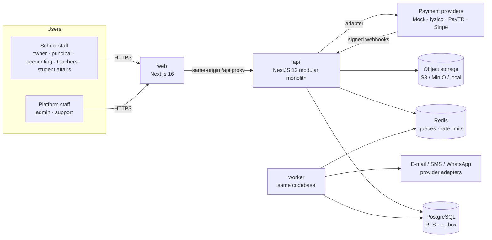

# System architecture

> Status: living document. Decisions referenced here are recorded as ADRs in
> [`docs/decisions`](../decisions). Related: [MULTITENANCY](MULTITENANCY.md),
> [AUTHORIZATION](AUTHORIZATION.md), [FINANCE_MODEL](FINANCE_MODEL.md),
> [DATA_MODEL](DATA_MODEL.md), [SECURITY](SECURITY.md), [DATA_PLATFORM](DATA_PLATFORM.md).

## 1. Goals and constraints

CampusOS is a multi-tenant B2B SaaS for education operations (schools, colleges, academies,
course centers, education groups). The architecture optimizes, in this order, for:

1. **Tenant isolation by construction.** A forgotten `WHERE` clause must not leak another
   tenant's data. Isolation is enforced by the application *and* by PostgreSQL row-level security
   (RLS) and tenant-scoped composite foreign keys.
2. **Fine-grained, server-side authorization.** Permissions are `resource.action` plus a scope
   (`own`, `assigned`, `branch`, `organization`). The client never decides what a user may see.
3. **Financial correctness and auditability.** Money is stored as integer minor units, payments are
   immutable (corrections are reversals), and the core invariants are enforced by database
   constraints and triggers, not only by application code.
4. **A small operational footprint.** PostgreSQL, Redis and S3-compatible storage. No Kubernetes,
   no Kafka in the request path, no per-tenant databases.
5. **A clean evolution path.** A modular monolith with explicit module boundaries and a
   transactional outbox, so services and a data platform can be split out without a rewrite.

Explicit non-goals for the MVP: microservices, event sourcing, general-ledger accounting,
per-tenant databases, native mobile apps, AI features in the critical path.

## 2. System context



Future guardian/student portals and mobile apps are additional clients of the same API.

## 3. Containers

| Container      | Technology                                  | Responsibility                                                                                 |
| -------------- | ------------------------------------------- | ---------------------------------------------------------------------------------------------- |
| `web`          | Next.js 16 (App Router), React 19, Tailwind 4 | UI, server-side session gate, same-origin proxy of `/api/*` to the API                       |
| `api`          | NestJS 12 on Node.js 22 (ESM)               | REST API (`/api/v1`), OpenAPI, authentication, authorization, domain logic                     |
| `worker`       | Same codebase as `api`, separate entrypoint | Outbox relay, BullMQ jobs (reminders, notifications, exports), scheduled tasks                 |
| PostgreSQL 16+ | Shared database, shared schema              | System of record, row-level security, transactional outbox                                     |
| Redis 7        | BullMQ, rate limiting                       | Job queues, distributed rate-limit counters                                                    |
| Object storage | S3-compatible (MinIO locally) or filesystem | Tenant files behind signed URLs                                                                |
| SMTP / SMS     | Adapters (Mailpit, console, mock)           | Outbound messages; no paid credentials required locally                                        |

The browser only ever talks to the `web` origin. In production a load balancer routes `/api/*`
to `api` and everything else to `web`, so cookies stay first-party and no CORS is needed
([ADR-0011](../decisions/0011-same-origin-bff-routing.md)).

## 4. Modular monolith

The API is one deployable with domain-oriented modules ([ADR-0001](../decisions/0001-modular-monolith.md)).

```
apps/api/src
├── platform/          # cross-cutting infrastructure: config, logging, errors, database, request context
├── core/              # TenantCore — reusable SaaS foundation
│   ├── auth/          # sessions, login, invitations, password reset
│   ├── authorization/ # authorization context, guards, scope predicates
│   ├── organizations/ # tenants, platform provisioning, organization settings, modules
│   ├── branches/
│   ├── members/       # memberships, branch access, role assignment
│   ├── roles/         # roles, permission catalog sync
│   ├── audit/         # append-only audit log
│   ├── outbox/        # transactional outbox + relay
│   ├── notifications/ # channels, templates, in-app notifications
│   ├── files/         # storage abstraction, file metadata
│   └── search/        # permission-aware global search
├── education/         # students, guardians, academic structure, attendance (phase 4)
├── finance/           # agreements, plans, receivables, payments, providers, collections
└── worker/            # worker bootstrap and job processors
```

Dependency rules:

- Domain modules (`education`, `finance`) depend on TenantCore; TenantCore never depends on a
  domain module.
- A module owns its tables. Other modules use its exported services for writes. Read models
  (dashboards, search, reports) may join across module tables in SQL, because that is where a
  relational database shines; such queries live in dedicated `*.queries.ts` files.
- Cross-module side effects that do not need to be synchronous go through domain events in the
  outbox (e.g. `payment.received` → receipt notification).
- Pure domain logic (installment schedules, allocation, aging) lives in framework-free files
  (`domain/*.ts`) with exhaustive unit tests.

## 5. Request lifecycle

```mermaid
sequenceDiagram
  autonumber
  participant B as Browser
  participant W as web (Next.js)
  participant A as api (NestJS)
  participant P as PostgreSQL
  B->>W: POST /api/v1/finance/payments (cookie: sid, header: x-csrf-token)
  W->>A: proxied request (same path)
  A->>A: request id (x-request-id) → AsyncLocalStorage
  A->>A: rate limit
  A->>P: resolve session (system pool) → user → active membership
  A->>A: authorization context (permissions, branch access) — cached by membership + authz_version
  A->>A: CSRF check · @RequirePermission('finance.payments.create') · Zod validation
  A->>P: BEGIN; set_config(app.org_id, app.user_id, app.branch_ids)
  A->>P: domain writes (RLS-enforced) + audit_logs + outbox_events
  A->>P: COMMIT
  A-->>B: 201 JSON (or application/problem+json)
```

Key properties:

- The tenant (`organization_id`) comes from the authenticated session, never from the request
  payload. Branch ids in payloads are validated against the member's branch access.
- Every tenant-scoped transaction sets PostgreSQL session variables with `set_config(..., true)`
  (transaction-local), so pooled connections never carry tenant context across requests.
- The domain mutation, its audit record and its outbox event commit atomically.

## 6. Data architecture

- **PostgreSQL, shared schema** with `organization_id` on every tenant-owned table, RLS forced on
  all of them, and composite `(organization_id, id)` foreign keys so cross-tenant references are
  impossible ([MULTITENANCY](MULTITENANCY.md), [ADR-0003](../decisions/0003-shared-schema-rls.md)).
- **Three database roles**: `app_owner` (migrations), `app_runtime` (tenant-scoped requests) and
  `app_system` (workers, platform operations, pre-authentication flows) — see
  [ADR-0004](../decisions/0004-database-roles.md).
- **Drizzle ORM** for type-safe queries and schema-driven migrations, plus hand-written SQL
  migrations for RLS, grants, triggers and functions ([ADR-0005](../decisions/0005-drizzle-and-sql-migrations.md)).
- **UUIDv7** primary keys generated by the application (time-ordered, index friendly); no
  sequential identifiers are exposed.
- **Money** as `bigint` minor units with an explicit ISO-4217 currency
  ([ADR-0008](../decisions/0008-money-integer-minor-units.md)).
- **Time**: instants are `timestamptz`; calendar facts (due dates, attendance days) are `date`
  interpreted in the organization's time zone (default `Europe/Istanbul`).
- **Operational vs analytical data** are separated at the architecture level. Dashboards use
  PostgreSQL aggregates and, when needed, materialized views. The analytical platform consumes the
  outbox/CDC stream later ([DATA_PLATFORM](DATA_PLATFORM.md)).

## 7. Asynchronous processing

- **Transactional outbox** ([ADR-0010](../decisions/0010-transactional-outbox.md)): domain events are
  rows in `outbox_events`, written in the same transaction as the change. The worker relays them
  with `SELECT … FOR UPDATE SKIP LOCKED`, dispatches to in-process handlers and marks them
  published. Debezium can later read the same table for CDC.
- **BullMQ on Redis** for jobs: notification delivery, reminder scheduling, exports, report
  generation, webhook processing. Jobs carry idempotency keys; retries use exponential backoff;
  exhausted jobs stay in the failed set (dead letter) and increment failure metrics. Outbox events
  that keep failing move to a `failed` state for manual inspection instead of blocking the stream.
- **Scheduled jobs** (daily overdue detection, reminder planning) are BullMQ repeatable jobs, so
  only one worker executes each tick.

## 8. Integrations through adapters

| Port                  | Adapters now                       | Planned                         |
| --------------------- | ---------------------------------- | ------------------------------- |
| `PaymentProvider`     | `MockPaymentProvider`              | iyzico, PayTR, Stripe           |
| `NotificationChannel` | SMTP (Mailpit), console, mock SMS, mock WhatsApp, in-app | Netgsm/İleti Merkezi SMS, WhatsApp Business |
| `StorageProvider`     | local filesystem, S3-compatible    | —                               |
| `AiGateway`           | none (documented interface only)   | provider chosen by privacy ADR  |

Provider-specific code never leaks outside its adapter. Webhooks are verified, stored in an inbox
table with a unique `(provider, event_id)` and processed idempotently.

## 9. Cross-cutting concerns

- **Observability**: structured JSON logs (pino) with request/correlation ids and PII redaction;
  OpenTelemetry tracing and metrics activated through standard `OTEL_*` variables; health
  endpoints for liveness/readiness. See [OBSERVABILITY](OBSERVABILITY.md).
- **Security**: OWASP-minded defaults — see [SECURITY](SECURITY.md).
- **Internationalization**: Turkish is the default product language; all UI strings live in
  message catalogs (`next-intl`). The API returns stable error codes; the client localizes them.
  Validation messages use Zod's Turkish locale.
- **Configuration**: environment variables validated with Zod at boot; the process refuses to
  start on invalid configuration, including unsafe database roles.

## 10. Deployment target

Stateless `api` and `web` containers scale horizontally behind a load balancer; `worker` scales
horizontally (BullMQ + `SKIP LOCKED` make that safe). Managed PostgreSQL with point-in-time
recovery and encrypted storage, managed Redis, S3 with public access blocked. A read replica can
serve reports when needed. IaC is planned in `infra/terraform`.

## 11. Evolution path

- **Service extraction**: a module becomes a service only when it needs independent scaling,
  ownership or SLA. Its outbox events become the public contract; its tables move with it.
- **Chains and franchises**: the organization → branch hierarchy and branch-scoped permissions
  already exist; group-level reporting adds an optional parent organization later
  ([MULTITENANCY §8](MULTITENANCY.md#8-future-chains-franchises-white-label)).
- **Data platform**: PostgreSQL → Debezium → Kafka/Redpanda → S3 → Spark → Redshift → dbt
  ([DATA_PLATFORM](DATA_PLATFORM.md)).
- **AI decision support**: through an `AiGateway` that only receives data the caller is already
  authorized to read, subject to a privacy ADR before any external provider is used.

## 12. Technology choices

| Concern            | Choice                                   | Notes / ADR                                                     |
| ------------------ | ---------------------------------------- | --------------------------------------------------------------- |
| Language           | TypeScript 6.0                           | TS 7 (native) pending ecosystem support — [ADR-0002](../decisions/0002-monorepo-and-toolchain.md) |
| Monorepo           | pnpm workspaces                          | [ADR-0002](../decisions/0002-monorepo-and-toolchain.md)         |
| Backend            | NestJS 12 (ESM), Express 5               | [ADR-0001](../decisions/0001-modular-monolith.md)               |
| Database           | PostgreSQL 16+                           | RLS, `pg_trgm`, `unaccent`, `citext`                            |
| Data access        | Drizzle ORM + node-postgres              | [ADR-0005](../decisions/0005-drizzle-and-sql-migrations.md)     |
| Validation/contracts | Zod 4 in `@repo/contracts`             | [ADR-0012](../decisions/0012-zod-contracts.md)                  |
| Jobs               | BullMQ 6 + Redis                         | [ADR-0010](../decisions/0010-transactional-outbox.md)           |
| Frontend           | Next.js 16, React 19, Tailwind CSS 4, Radix primitives, TanStack Query/Table, React Hook Form | own design system in `@repo/ui` |
| Auth               | Server-side sessions, argon2id           | [ADR-0006](../decisions/0006-server-side-sessions.md)           |
| Authorization      | RBAC + scopes, shared catalog            | [ADR-0007](../decisions/0007-rbac-with-scopes.md)               |
| Testing            | Vitest, Testing Library, Playwright      | [TESTING](../development/TESTING.md)                            |
